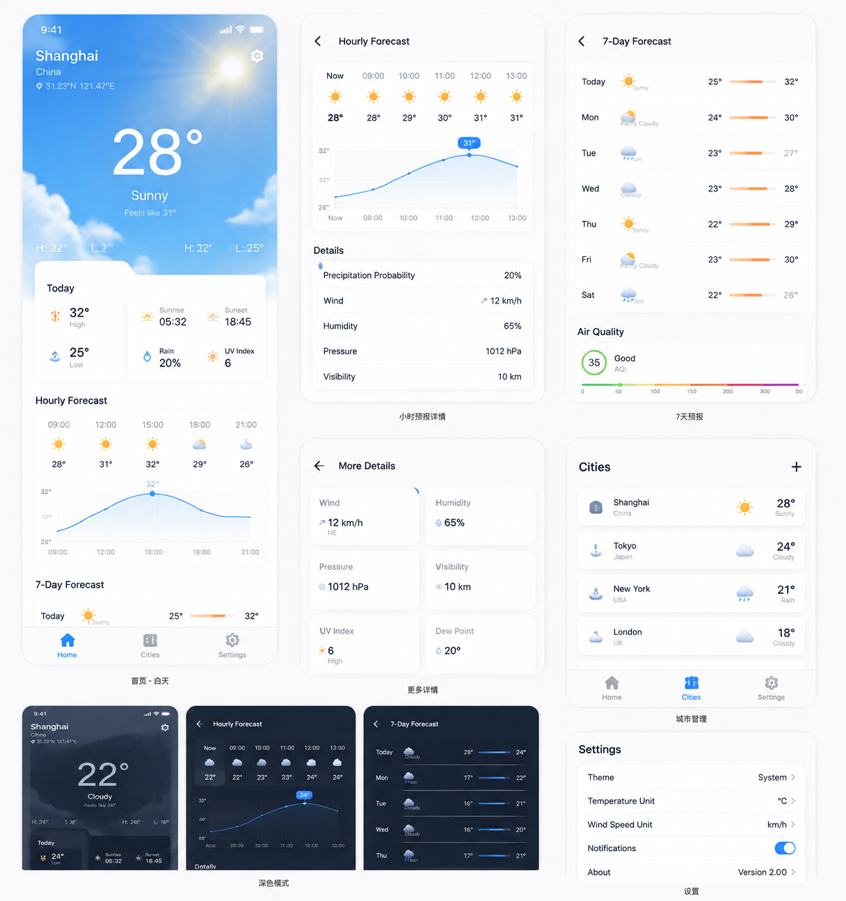
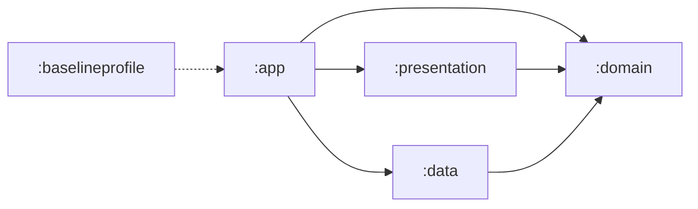

# MinimalistWeather

MinimalistWeather 是一款 Kotlin-first、Compose-first 的 Android 天气应用。项目已从早期 Java/MVP 示例迁移为多模块 Clean Architecture，使用 Open-Meteo 提供城市搜索、天气预报和空气质量数据。

> 项目仍在持续开发中。当前包名：`cn.byronlab.weather`。



## 功能

- 当前天气、体感温度、今日摘要和生活指数；
- 24 小时趋势与 7 日天气预报；
- AQI、主要污染物及详细天气指标；
- 按天气、昼夜、云量、风力和降水状态变化的 Compose 动态场景；
- 内置全球热门城市、本地优先 + Open-Meteo 在线城市搜索；
- 当前定位、最近访问城市、已添加城市及城市天气预览；
- DataStore 持久化当前城市、城市列表、刷新设置和天气缓存；
- 前台生命周期自动刷新与 WorkManager 后台周期刷新；
- AndroidX SplashScreen、R8、Baseline Profile 与冷启动 Macrobenchmark。

## 技术栈

| 类别 | 技术 |
| --- | --- |
| 语言与构建 | Kotlin 2.3.21、JDK 17、Gradle 9.4.1、AGP 9.2.0、KSP |
| UI | Jetpack Compose、Material 3、单 Activity、edge-to-edge |
| 架构 | Clean Architecture、UDF、ViewModel、不可变 `StateFlow` |
| 异步 | Kotlin Coroutines、`suspend`、Flow |
| 依赖注入 | Hilt + Dagger 构造注入 |
| 网络与 JSON | OkHttp 5.3.0、Kotlinx Serialization 1.11.0 |
| 本地数据 | DataStore Preferences、SharedPreferences migration |
| 后台任务 | WorkManager |
| 性能 | Baseline Profile、Startup Profile、Macrobenchmark |
| 测试 | JUnit 4、Kotlin Coroutines Test、AndroidX Benchmark |

依赖、插件、SDK 和应用版本统一声明在 [`gradle/libs.versions.toml`](gradle/libs.versions.toml)。

## 架构



| 模块 | 职责 |
| --- | --- |
| `:app` | Application、Activity、Hilt 装配、Android 定位、WorkManager 与资源入口 |
| `:presentation` | Compose 页面、ViewModel、UI state/event/effect、UI mapper 与天气视觉引擎 |
| `:data` | Open-Meteo 网络边界、DTO/parser/mapper、DataStore 与 Repository 实现 |
| `:domain` | 纯 Kotlin/JVM 的业务模型、Repository 契约、UseCase 与结果类型 |
| `:baselineprofile` | Baseline/Startup Profile 生成与冷启动 Macrobenchmark |

核心依赖方向为 `app -> presentation -> domain` 与 `app -> data -> domain`；`domain` 不依赖 Android framework。

## 数据来源与本地状态

- 城市搜索：[Open-Meteo Geocoding API](https://open-meteo.com/en/docs/geocoding-api) + 内置全球热门城市目录；
- 天气预报：[Open-Meteo Forecast API](https://open-meteo.com/en/docs)；
- 空气质量：[Open-Meteo Air Quality API](https://open-meteo.com/en/docs/air-quality-api)；
- 当前定位：Android `LocationManager` 与 `Geocoder`；
- 当前城市、最近城市、已添加城市、刷新间隔及天气缓存：DataStore Preferences。

当前实现不需要配置 API key。网络请求全部使用 HTTPS；定位能力需要用户授予粗略或精确位置权限。

## 开发环境

- Android Studio（需兼容 AGP 9.2.0）；
- JDK 17；
- Android SDK 37；
- Android 6.0（API 23）或更高版本的设备/模拟器。

使用 Android Studio 打开仓库根目录并等待 Gradle Sync 完成，或直接运行：

```bash
./gradlew assembleDebug
```

Debug APK 输出到：

```text
app/build/outputs/apk/debug/app-debug.apk
```

## 验证

完整的本地验证命令：

```bash
./gradlew test lint assembleDebug
```

开发过程中也可以只运行受影响模块：

```bash
./gradlew :domain:test
./gradlew :data:test
./gradlew :presentation:test
```

在已连接测试设备时生成 Baseline Profile：

```bash
./gradlew :app:generateBaselineProfile
```

启动性能数据容易受到设备状态影响；Macrobenchmark 结果应在固定状态的真机上重复采集后再比较。

## 项目文档

- [现代化 Clean Architecture 迁移计划](docs/modern-clean-architecture-plan.md)
- [界面设计说明](docs/design.md)
- [AI 工程协作指南](AGENTS.md)

项目最初用于展示 Android 工程架构与常用开源库的实践。当前 active app 已不再使用旧 MVP、RxJava、Retrofit、ORMLite、ButterKnife、FastJson 或 Stetho；旧架构图 [`framework_minimalist_weather.png`](framework_minimalist_weather.png) 仅保留为历史资料。

欢迎关注微信公众号：**BaronNode**

<div align="center"></div>

## 许可

```text
Copyright 2017 Byron

Licensed under the Apache License, Version 2.0 (the "License");
you may not use this file except in compliance with the License.
You may obtain a copy of the License at

   http://www.apache.org/licenses/LICENSE-2.0

Unless required by applicable law or agreed to in writing, software
distributed under the License is distributed on an "AS IS" BASIS,
WITHOUT WARRANTIES OR CONDITIONS OF ANY KIND, either express or implied.
See the License for the specific language governing permissions and
limitations under the License.
```
